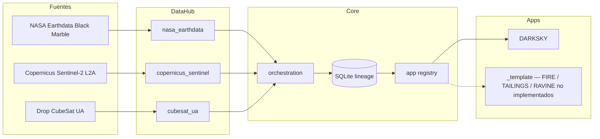

# Arquitectura — ECOAVES OrbitalOS

MVP: **Core + DataHub + DARKSKY**. FIRE, TAILINGS y RAVINE no están implementados
(solo el molde en `apps/_template/README.md`).

## Capas: Fuentes → DataHub → Core → Apps

```text
Fuentes                         DataHub                          Core                         Apps
───────                         ───────                          ────                         ────
NASA CMR/LAADS  ──JSON──►       nasa_earthdata  ─┐
  Black Marble                   (VJ146A1/VJ246A1 │
  Collection 2                    preferidos)     │
                                                  ├─► Scene + Provenance ─► storage ─► registry ─► darksky
CDSE STAC/SH    ──JSON──►       copernicus_sentinel┤   (esquema propio)     SQLite      (dispatch)   (NASA+UA)
  Sentinel-2 L2A                 (conectado,       │
  (óptico diurno)                 testeado;        │
                                  DARKSKY no lo    │
                                  consume)         │
UA drop *.product ────────────► cubesat_ua      ─┘
  + events.jsonl                 (sin geo real)
```



Cada flecha hacia la derecha es un contrato versionado. El Core no conoce URLs, tokens
ni productos satelitales. Un app no abre el drop ni llama APIs: recibe `Scene` ya
normalizadas, cada una con `Provenance` completa.

## Regla dura de aislamiento del software de vuelo de la UA

OrbitalOS **nunca**:

1. importa un módulo Python del software de vuelo,
2. lanza un subproceso contra su código,
3. abre una ruta de su árbol interno (`raw/`, `work/`, `catalog.sqlite3`, …),
4. copia, vende o reusa su fuente (ni “inspiración” literal).

La única frontera es un directorio drop ya publicado:

```text
{capture_id}.{kind}.product
events.jsonl
```

Contrato JSON de análisis: `ua.blue_proxy.analysis.v1`. DARKSKY no recalcula
`blue_proxy` ni desempaqueta `MBRAW1`/HDF de la carga útil. El protocolo de bajada
(GUTS/Pumpkin u otro) **no** está confirmado: el MVP trata el drop como filesystem local.

El aislamiento se cubre con `tests/unit/test_no_network.py` (sin `subprocess` ni clientes
HTTP de terceros en producción) y con tests de contrato del adaptador `cubesat_ua`.

## Qué consume DARKSKY

| Fuente | Estado DataHub | DARKSKY |
| --- | --- | --- |
| `nasa_earthdata` | conectada (CMR `granules.umm_json`, grabaciones en CI) | **primaria** — cobertura de gránulos Black Marble, sin fotometría DNB unpack |
| `cubesat_ua` | conectada (drop local) | **secundaria** — `flagged_pct`, nivel, grilla 8×6 `scene_relative` |
| `copernicus_sentinel` | conectada (STAC `sentinel-2-l2a`, OAuth opcional) | **no** — `sentinel_used: false` |

Sentinel está ingerido y testeado a propósito: el DataHub es genérico. El app decide.
No existe producto Copernicus de luces nocturnas equivalente a VIIRS/Black Marble;
usar L2A como DNB sería inventar una capacidad (ver `docs/gaps.md`).

## URLs y credenciales

Viven **solo** en `datahub/adapters/*/endpoints.py`, sobrescribibles por entorno
(`ECOAVES_CMR_GRANULES`, `ECOAVES_CDSE_STAC_SEARCH`, `ECOAVES_CDSE_OAUTH_TOKEN`,
`ECOAVES_CDSE_SH_PROCESS`). Motivo: Earthdata unifica sitios en 2026; Sentinel Hub
reestructuró rutas en marzo 2026; Suomi NPP deja de entregar datos el **2026-11-01**.

Credenciales (nunca en git): `EARTHDATA_TOKEN`, `CDSE_CLIENT_ID`, `CDSE_CLIENT_SECRET`.

CI usa `RecordedTransport`. `LiveHttpTransport` (stdlib `urllib`) solo en
`datahub/http.py` y en `scripts/live_*.py`. El CLI de `run` no instancia transporte vivo.

## Tests

`python3 -m pytest` desde `ecoaves-orbitalos/`. Sin red. Fixtures sintéticas +
JSON grabados bajo `tests/integration/recordings/`.
